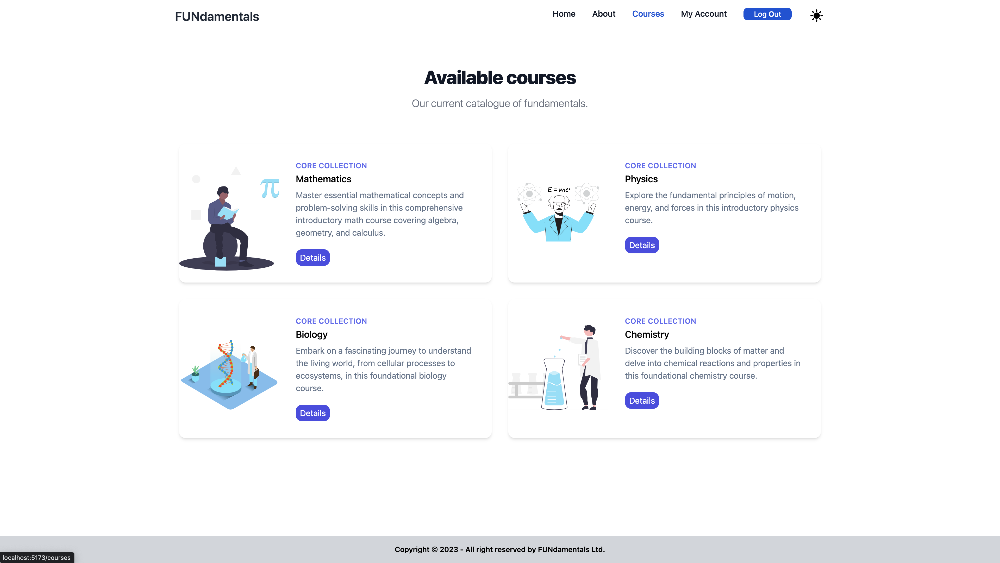
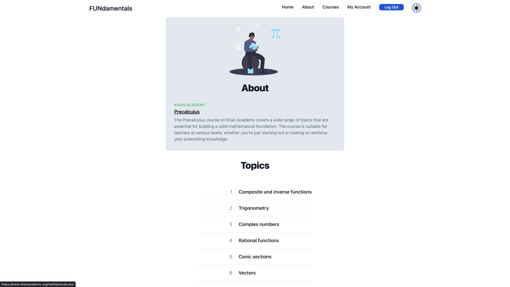
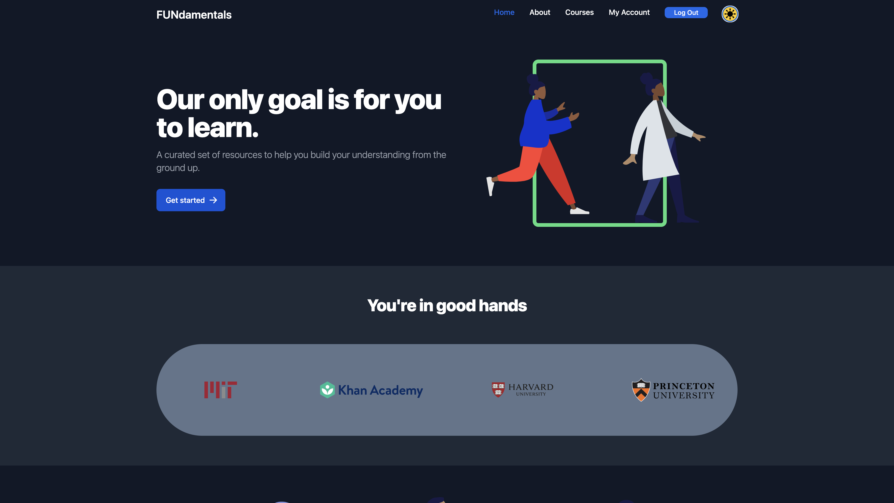
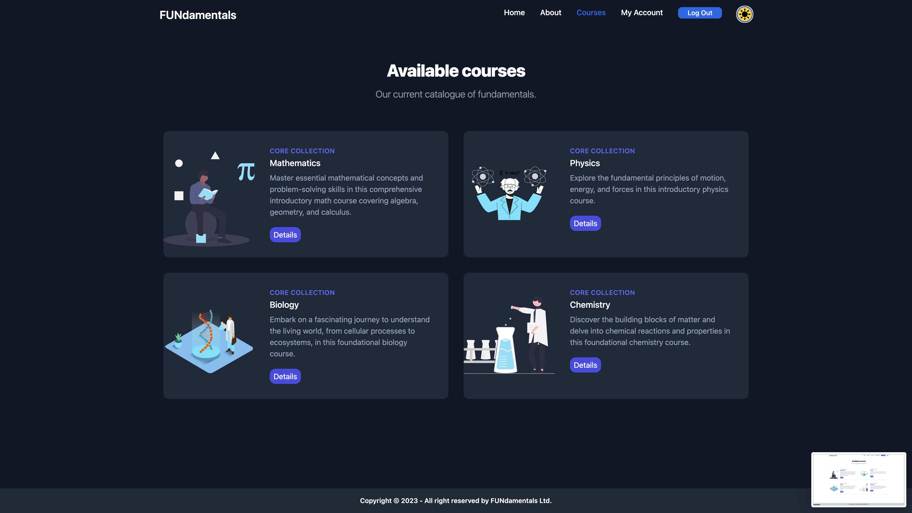
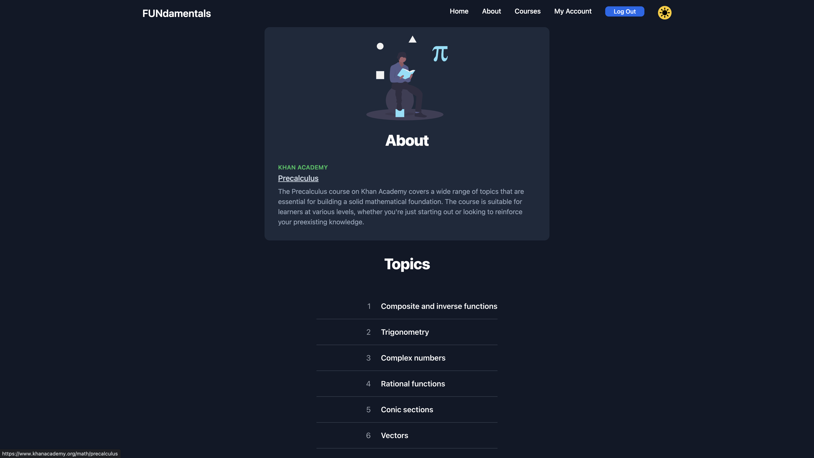

#### Readme

# FUNdamentals

## Description

FUNdamentals offers a curated set of resources to help people build their understanding from the ground up. Not everyone learns at the same rate, and if you missed even one chain in the link, you may have a gap in your understanding. I've personally been affected by this, and wanted to contribute to solving this problem by offering a curated set of resources in a user-friendly way. I hope it helps.  

This project was inspired by a quote I heard from Naval Ravikant (Co-founder, Chairman, and former CEO of AngelList):

"I’m sure 90% of you had this happen to you, when you were learning mathematics. At some point, you were keeping up, you were doing arithmetic, then you were doing geometry, then trigonometry, pre-calculus, and calculus.

Somewhere in there, you got lost. Somewhere while building this massive edifice (the logical structure of mathematics) you missed one lesson. You missed one concept, just a few classes, or your brain couldn’t think the specific way something was being explained. It should have been explained visually, but it was being explained numerically. Or it should have been explained symbolically and it was being explained in cartography. You were not able to keep up.

The moment you miss a rung in the ladder of mathematics, you can’t go to the next one. The teacher says, “We’re done with pre-calculus, we’re moving on to calculus.” You’re saying, “Wait, I didn’t understand pre-calculus. I didn’t understand how pre-calculus leads from trigonometry to calculus. I missed that whole part.”

Now you get to calculus, and you don’t understand the fundamentals. Now, you’re reduced to memorization. You’re like, “DX/DY. When I see the symbol, I do this.” You’ve lost the actual learning. You’ve lost the connection to the underlying principles.

We teach all these kids calculus and they walk out not understanding calculus at all."

"I think learning should be about learning the basics in all the fields and learning them really well over and over. Life is mostly about applying the basics and only doing the advanced work in the things you truly love, and where you understand the basics inside out."

## Installation

1. Clone this repository. 
2. Open your terminal. Navigate to the root directory, then "cd" into the client folder.
3. Run "npm install", then "npm run dev". 

## Usage

### Screenshots

#### Landing Page ####

#### Courses Page ####

#### Detailed Course Page ####

#### Dark Mode ####

#### Landing Page ####

#### Courses Page ####

#### Detailed Course Page ####
